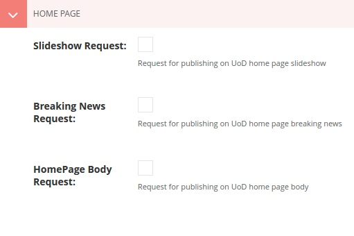

====
Page
====

Types
=====
    
    Pages are classified into types to meet different aspects. They are:

    .. note::
        Types ending with "list" are just containers for the types with the preceding word. For example, ``Activity List`` page has to be added as a parent of the subsequent ``Activity`` pages.

    +-----------------------------+--------------------------------------------+---------------------------------------------+
    |   Type                      |     Allowed Parent Type                    |      Allowed Child Type                     |
    +=============================+============================================+=============================================+
    | Activity List               | [a]_                                       | Activity                                    |
    +-----------------------------+--------------------------------------------+---------------------------------------------+
    | Activity                    | Activity List                              | [c]_                                        | 
    +-----------------------------+--------------------------------------------+---------------------------------------------+
    | Announcement List           | [a]_                                       | Annoucement                                 |
    +-----------------------------+--------------------------------------------+---------------------------------------------+
    | Announcement                | Announcement List                          | [c]_                                        | 
    +-----------------------------+--------------------------------------------+---------------------------------------------+
    | Contatc Form Page           | [a]_                                       | [c]_                                        | 
    +-----------------------------+--------------------------------------------+---------------------------------------------+
    | Contatc Page                | [a]_                                       | [c]_                                        | 
    +-----------------------------+--------------------------------------------+---------------------------------------------+
    | Directorate List            | [a]_                                       | Directorate                                 | 
    +-----------------------------+--------------------------------------------+---------------------------------------------+
    | Directorate                 | Directorate List                           | [c]_ [s]_ excpet ``College``                | 
    +-----------------------------+--------------------------------------------+---------------------------------------------+
    | Event List                  | [a]_                                       | Event                                       | 
    +-----------------------------+--------------------------------------------+---------------------------------------------+
    | Event                       | Event List                                 | [c]_                                        | 
    +-----------------------------+--------------------------------------------+---------------------------------------------+
    | Form Page                   | [a]_                                       | [c]_                                        | 
    +-----------------------------+--------------------------------------------+---------------------------------------------+
    | News List                   | [a]_                                       | News                                        | 
    +-----------------------------+--------------------------------------------+---------------------------------------------+
    | News                        | News List                                  | [c]_                                        | 
    +-----------------------------+--------------------------------------------+---------------------------------------------+
    | Office List                 | [a]_                                       | Office                                      | 
    +-----------------------------+--------------------------------------------+---------------------------------------------+
    | Office                      | Office List                                | [c]_                                        | 
    +-----------------------------+--------------------------------------------+---------------------------------------------+
    | Page                        | [a]_                                       | [c]_                                        | 
    +-----------------------------+--------------------------------------------+---------------------------------------------+
    | Project List                | [a]_                                       | Project                                     | 
    +-----------------------------+--------------------------------------------+---------------------------------------------+
    | Project                     | Project List                               | [c]_                                        | 
    +-----------------------------+--------------------------------------------+---------------------------------------------+
    | Research List               | [a]_                                       | Research                                    | 
    +-----------------------------+--------------------------------------------+---------------------------------------------+
    | Research                    | Research List                              | [c]_                                        | 
    +-----------------------------+--------------------------------------------+---------------------------------------------+
    | Scholarship List            | [a]_                                       | Scholarship                                 | 
    +-----------------------------+--------------------------------------------+---------------------------------------------+
    | Sccholarship                | Scholarship List                           | [c]_                                        | 
    +-----------------------------+--------------------------------------------+---------------------------------------------+
    | Workshop List               | [a]_                                       | Workshop                                    | 
    +-----------------------------+--------------------------------------------+---------------------------------------------+
    | Workshop                    | Workshop List                              | [c]_                                        | 
    +-----------------------------+--------------------------------------------+---------------------------------------------+
    | Seminar List                | [a]_                                       | Seminar                                     | 
    +-----------------------------+--------------------------------------------+---------------------------------------------+
    | Seminar                     | Seminar List                               | [c]_                                        | 
    +-----------------------------+--------------------------------------------+---------------------------------------------+
    | Unit List                   | [a]_                                       | Unit                                        | 
    +-----------------------------+--------------------------------------------+---------------------------------------------+
    | Unit                        | Unit List                                  | [c]_                                        | 
    +-----------------------------+--------------------------------------------+---------------------------------------------+
    | College List                | [l]_                                       | College                                     | 
    +-----------------------------+--------------------------------------------+---------------------------------------------+
    | College                     | College List                               | [c]_                                        | 
    +-----------------------------+--------------------------------------------+---------------------------------------------+
    | Center List                 | [s]_ excpet ``Center``                     | Center                                      | 
    +-----------------------------+--------------------------------------------+---------------------------------------------+
    | Center                      | Center List                                | [c]_                                        | 
    +-----------------------------+--------------------------------------------+---------------------------------------------+


    .. [a] **Any type**.
    .. [-] **None**.
    .. [c] **Common**: Activity, Announcement, Contatc Form Page, Contact Page, Event List, Form Page, News List, Page, Project List, Research List, Scholarship List, Seminar List, Workshop List.
    .. [s] **Spatial**: Office, College, Unit, Center, Directorate
    .. [l] **LOCKED**


Fields
======

Content
-------

``Title``
`````````

    The ``title`` is required (at least in English (EN)), without it the page can not be created. ``Title`` is also equired for auto-generating the ``Slug`` and the HTML ``Page title``.

    .. image:: static/page_content_title.jpg
       :target: _images/page_content_title.jpg

.. tip::
    If you don't have the English translation of your article title, just paste in the available one (Arabic or Kurdish).


----------


``Body``
````````

    The page content can have text, images, videos and documents.

    .. image:: static/page_content_body.jpg
        :target: _images/page_content_body.jpg


----------


``Images``
``````````

    Unlimited number of images can be added to the page. Supported formats are ``.jpg`` and ``.png``. Maximum file size is **10MB**. 

    .. tip::
        Images can link to pages or external web pages. Use ``Link page`` or ``External Link`` for this purpose.

    .. image:: static/page_content_images.jpg
        :target: _images/page_content_images.jpg


----------


``Related Links``
`````````````````

    You may find it useful sometimes to add some related content links for the reader. Number of links are unlimited.

    .. image:: static/page_content_relatedlinks.jpg
        :target: _images/page_content_relatedlinks.jpg


----------


Promote
-------

HomePage
````````



``Slideshow Request``
`````````````````````
    Ticking this notifies the super admin to approve the content and get displayed on the homepage slideshow.

    .. image:: static/page_promote_homepage_slideshow.jpg
        :target: _images/page_promote_homepage_slideshow.jpg

.. warning::
    Choose an appropriate picture for the article. The first image you add will be used in the slideshow. Take a look at the **image spesifications policy**.


``Breaking News Request``
`````````````````````````
    Ticking this notifies the super admin to approve the content and get displayed on the homepage breaking news bar. 

    .. image:: static/page_promote_homepage_breakingnews.jpg
        :target: _images/page_promote_homepage_breakingnews.jpg    


``HomePage Body Request``
`````````````````````````
    Ticking this notifies the super admin to approve the content and get displayed on the homepage "Top Stories" section. 

    .. image:: static/page_promote_homepage_body.jpg
        :target: _images/page_promote_homepage_body.jpg