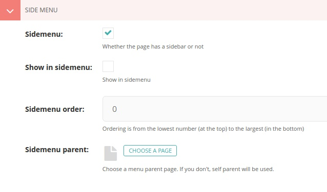
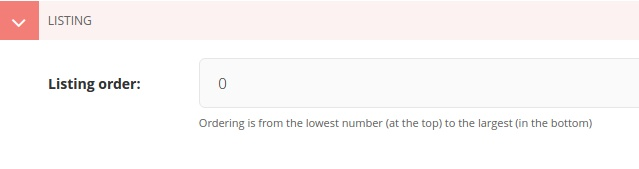

Promote Tab
===========

HomePage
--------
.. image:: static/page_promote_homepage.jpg
    :target: _images/page_promote_homepage.jpg

----------

``Slideshow Request``
`````````````````````
    Ticking this notifies the super admin to approve the content and get displayed on the homepage slideshow.
        * **Type**: Check Box. 
        * **Default Value**: Unchecked.
    
    .. image:: static/page_promote_homepage_slideshow.jpg
        :target: _images/page_promote_homepage_slideshow.jpg

.. warning::
    Be careful. Choosing inappropriate content may cause denial.

    The first image added, to the article, is used for the slideshow. Invalid images will be rejected. Please take a look at the **image specifications policy**.

----------

``Breaking News Request``
`````````````````````````
    Ticking this notifies the super admin to approve the content and get displayed on the homepage breaking news bar.
        * **Type**: Check Box. 
        * **Default Value**: Unchecked.

    .. image:: static/page_promote_homepage_breakingnews.jpg
        :target: _images/page_promote_homepage_breakingnews.jpg    

----------

``HomePage Body Request``
`````````````````````````
    Ticking this notifies the super admin to approve the content and get displayed on the homepage "Top Stories" section. 
        * **Type**: Check Box. 
        * **Default Value**: Unchecked.


    .. image:: static/page_promote_homepage_body.jpg
        :target: _images/page_promote_homepage_body.jpg


----------

Side Menu
---------



----------

``Sidemenu``
````````````
    Displays or hides the side menu on the page.
        * **Type**: Check Box. 
        * **Default Value**: Checked.

----------

``Show in sidemenu``
````````````````````
    Adds the link of the page as an item in the sidemenu. 
        * **Type**: Check Box. 
        * **Default Value**: Unchecked.

----------

``Sidemenu Order``
``````````````````
    The order of the page link among its siblings on the same menu level.  
        * **Type**: Integer.
        * **Default Value**: 0.

    .. note::
        Ordering starts from the minimum value and goes down with the increase of the value. So, zero (0) is on the top, (1) one is the next and so on.

    .. tip::
        For a more dynamic approach, put the value (0) for the first item, and (10) for the second, (20) for the third and so on. In this way you'll save some places for the new outcome items, to be inserted between, as needed. 

    .. note::
        Similar values are handled on the basis of alphabetical order.

----------

``Sidemenu Parent``
```````````````````
    Each page has a parent. But if you want to change it in the side menu you can replace it here.  
        * **Type**: Page.
        * **Default Value**: Null.

----------

Listing
-------



----------


``Listing order``
```````````````````
    The order of the page link among its siblings in the listing page. For example, list of members.  
        * **Type**: Integer.
        * **Default Value**: 0.

    .. image:: static/departments_listing.jpg
        :target: _images/departments_listing.jpg

    .. image:: static/members_listingorder.jpg
        :target: _images/members_listingorder.jpg

    .. note::
        Ordering starts from the minimum value and goes down with the increase of the value. So, zero (0) is on the top, (1) one is the next and so on.

    .. tip::
        For a more dynamic approach, put the value (0) for the first item, and (10) for the second, (20) for the third and so on. In this way you'll save some places for the new outcome items, to be inserted between, as needed. 

    .. note::
        Similar values are handled on the basis of alphabetical order.